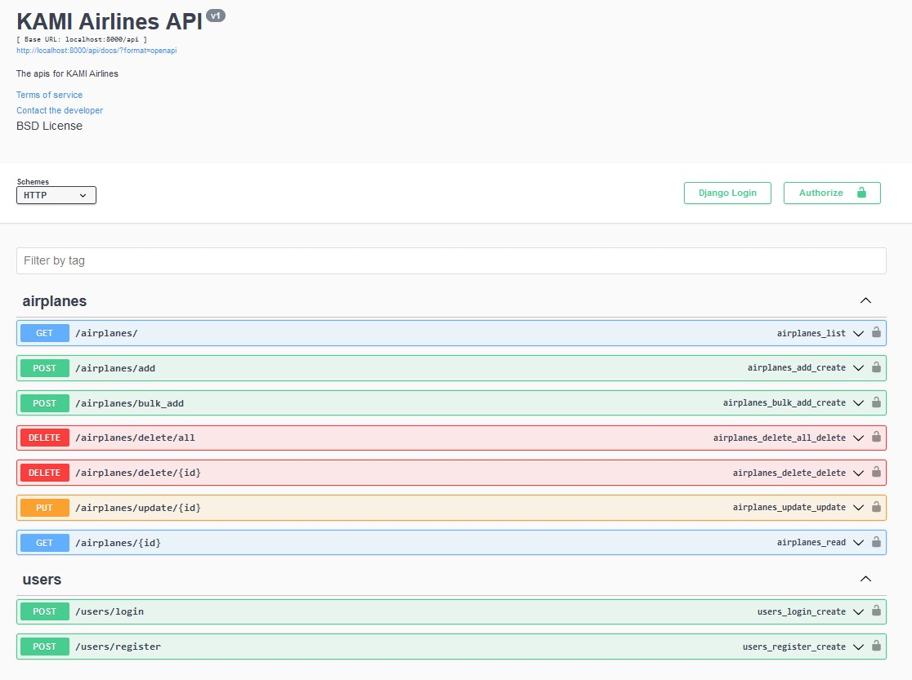
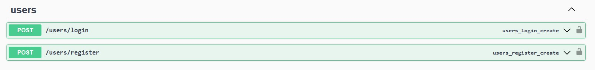
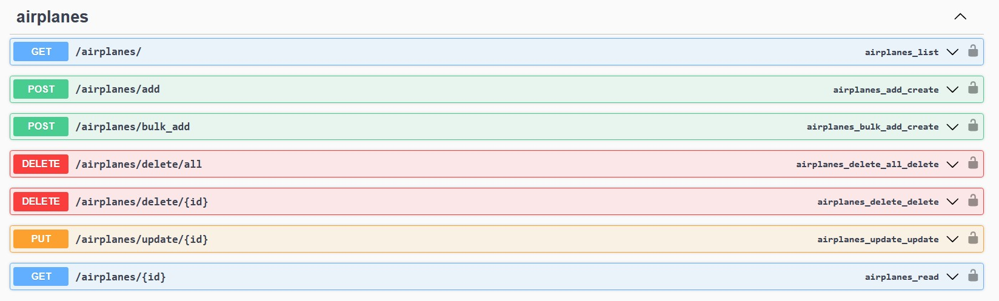
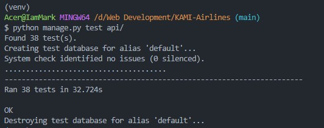
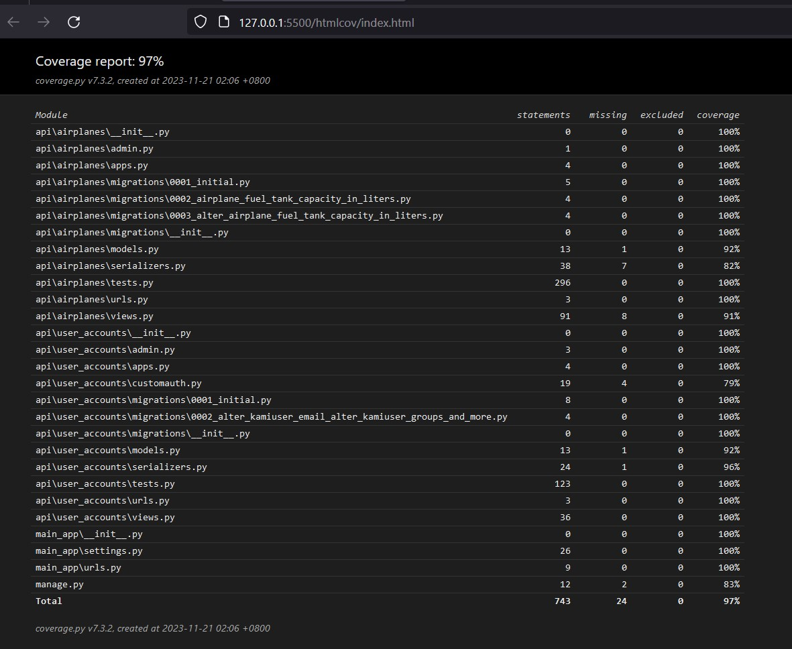

# KAMI-Airlines

## Setup and installation

To set up and run the project, follow these steps:

1. Create a virtual environment (recommended) and activate it (use git bash recommended):
    ```bash
    python -m venv venv
    source venv/bin/activate
    ```
2. Install the required Python packages from the requirements.txt file:
    ```bash
    pip install -r requirements.txt
    ```
3. Run the migrate command to automate creation of tables:
    ```bash
    python manage.py makemigrations
    ```
4. Run the server using this following commands:
    ```bash
    python manage.py runserver
    ```
    The server should now be accessible at http://localhost:8000/.

## List of available APIs

### Swagger Docs

-   GET http://localhost:8000/
-   GET hhttp://localhost:8000/api/docs/



### Users API

-   GET http://localhost:8000/users/login
-   GET hhttp://localhost:8000/users/register



### How to use the access token to access airplanes api endpoint.

-   create a user account and log in using the valid credentials
-   copy the access_token from the response data
-   click authorize at the top portion. And the value should be - "Bearer Your_Token"
    .gif>)

### Airplanes API

-   GET http://localhost:8000/api/airplanes
-   GET http://localhost:8000/api/airplanes/{id}
-   POST http://localhost:8000/api/airplanes/add
-   POST http://localhost:8000/api/airplanes/bulk_add
-   PUT http://localhost:8000/api/airplanes/update/{id}
-   DELETE http://localhost:8000/api/airplanes/delete/{id}
-   DELETE http://localhost:8000/api/airplanes/delete/



## Tests

To run unit tests, follow these steps

1. Make sure the server is running
2. Open a new terminal and create a virtual environment (recommended) and activate it (use git bash recommended):
    ```bash
    python -m venv venv
    source venv/bin/activate
    ```
3. Run unit tests using this following commands:
    ```bash
    python manage.py test api/
    ```

-   There are a total of 38 tests.



## Code Coverage Results

To run code coverage, follow these steps

1. Run django tests witth the 'coverage' run command:
    ```bash
    coverage run manage.py test
    ```
2. You can view a coverage reportt in the terminal by running:

    ```bash
    coverage report
    ```

    

3. To generate html report, use the following command:

    ```bash
    coverage html
    ```

    - Then go to htmlcov folder and run index.html in the browser

    
